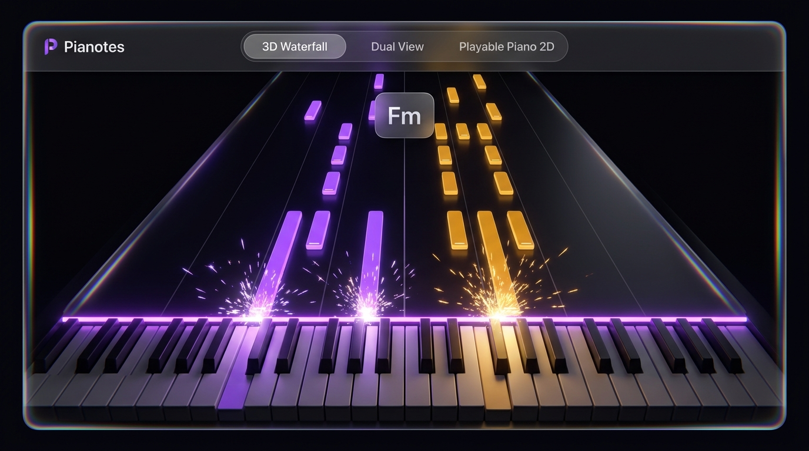
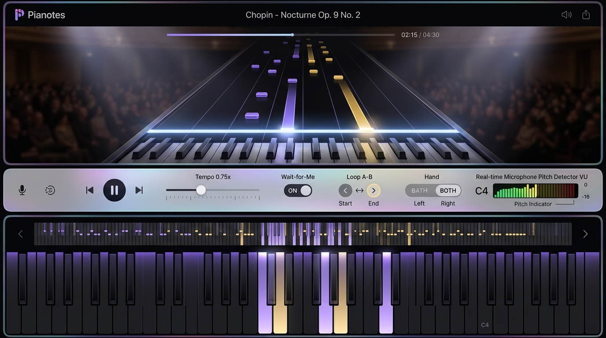
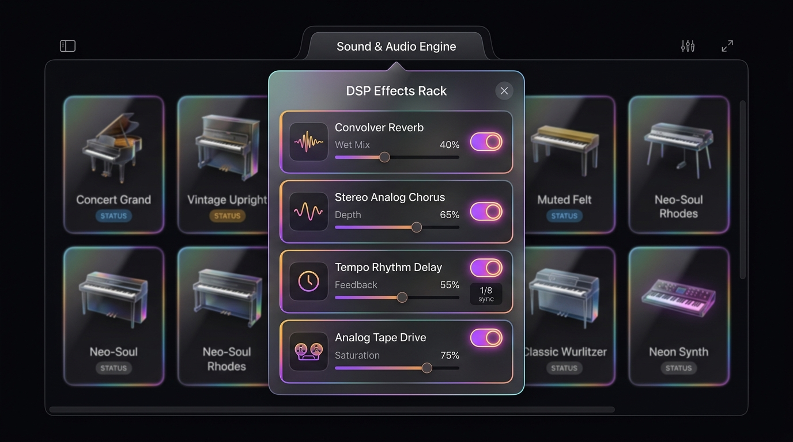

# Pianotes 🎹✨

<div align="center">


<p align="center">
  <b>A 1:1 Apple Liquid Glass 3D Piano & Falling Note Synthesizer for the Web and Mobile.</b><br>
  Dual viewports, physical key tilting, interactive performance scoring & combo streaks, live performance recorder, standard MIDI (.mid) export, concert pitch micro-tuning (A440, A432, A442, A415 Baroque), audio metronome with visual glass pendulum, Web MIDI hardware support, real-time IRL acoustic microphone pitch detection, 9-voice sound engine, 4-stage DSP effects rack, and Demucs / ByteDance AMT neural transcription studio.
</p>

</div>

---

<div align="center">
  
</div>

---

## 🌟 Overview

**Pianotes** is an open-source piano application built to redefine music learning and performance on modern screens. Inspired by classic falling-note synthesizers and infused with Apple’s state-of-the-art **Liquid Glass** aesthetic, Pianotes combines 3D perspective graphics, tactile physical spring dynamics, studio-grade Web Audio synthesis, interactive rhythm game gamification, live performance recording with standard MIDI export, and intelligent practice modes.

Whether you want to learn classical masterpieces with the intelligent **"Wait-for-Me"** mode, evaluate your strike accuracy with real-time scoring, record and download your performances as standard `.mid` files, micro-tune your instrument to healing A432Hz or Baroque A415Hz, jam on the **88-key touch keyboard**, listen to your **real acoustic piano** via your microphone, or transcribe piano pieces from **Instagram Reels, TikToks, and YouTube Shorts**, Pianotes delivers an uncompromised experience.

---

## 💎 Core Highlights

### 1. 1:1 Apple Liquid Glass Aesthetic
- **Multi-pass Optical Refraction & Dispersion**: Real-time chromatic aberration along beveled glass borders using SVG `feDisplacementMap` and RGB channel separation matrices.
- **Hooke's Spring Gel Physics**: Buttons, pills, and bottom sheets dynamically indent when pressed and elastically recoil on release with true spring physics.
- **Dynamic Specular Sheen**: Pointer tracking calculates incident light angles to sweep specular radial highlights across glass panels in real time.
- **220% Saturation Boost**: Backdrop filters amplify color vibrancy through glass elements, eliminating muddy greys and giving rich, luminous presence.
- **Obsidian Dark Palette (`#050508`)**: Ambient luminescence contrasts cleanly against midnight obsidian black.
- **Hand Isolation Colorway**: Left Hand in Electric Violet (`#a855f7`) and Right Hand in Radiant Warm Amber (`#f59e0b`).

---

### 2. Dual Viewport Architecture
<div align="center">
  
</div>

- **3D Perspective Waterfall Viewport**:
  - WebGL rendered with Three.js.
  - Left Hand violet (`#a855f7`) and Right Hand amber (`#f59e0b`) cascading note bars.
  - Realistic mechanical 3D key tilting on balance pin fulcrum dynamics when notes strike.
  - Neon strike line with active particle burst cosmic sparks.
  - Interactive camera orbit navigation (click and drag to rotate viewing angles in 3D space, mouse wheel / pinch zoom).
  - Quick "Reset 3D View" glass pill button and canvas double-click gesture.
  - Floating chord badge displaying real-time harmonic analysis (`Fm`, `C`, `Ab`, `Bb`, etc.).
- **2D Standalone Playable Piano**:
  - Full 88-key keyboard (MIDI 21 $A_0$ to MIDI 108 $C_8$) with white and black key physics.
  - Touch-sensitive glissando sliding across keys without missing a note.
  - Dedicated Octave Switcher buttons (`C1` through `C7` and `[◀ Oct]` / `[Oct ▶]`) for rapid viewport repositioning.
  - Octave navigator mini-map ribbon.
  - Real-time LED key illumination reflecting both computer playback and user interaction.
- **Split Dual View**:
  - Simultaneous top 3D waterfall and bottom 2D playable piano with real-time bidirectional synchronization.

---

### 3. Interactive Performance Scoring & Gamification (v1.3.0)
- **Real-Time Note Strike Precision Evaluation**:
  - Compares user key strikes from touch, keyboard, MIDI controller, or acoustic microphone against song notes in real-time.
  - **PERFECT**: Strike timing within $\pm 30\text{ ms}$ ($+100\text{ base points} \times \text{multiplier}$)
  - **GREAT**: Strike timing within $\pm 70\text{ ms}$ ($+75\text{ base points} \times \text{multiplier}$)
  - **EARLY**: Struck between $-71\text{ ms}$ and $-150\text{ ms}$ ahead ($+40\text{ base points}$)
  - **LATE**: Struck between $+71\text{ ms}$ and $+200\text{ ms}$ behind ($+40\text{ base points}$)
  - **MISS**: Note passed by $> 200\text{ ms}$ without being struck (breaks streak back to $1\times$)
- **Live Streak Multiplier & Cosmic Aura**:
  - $1\times$ Multiplier: $0\text{--}9$ streak hits
  - $2\times$ Multiplier: $10\text{--}24$ streak hits
  - $4\times$ Multiplier: $25\text{--}49$ streak hits
  - $8\times$ Multiplier: $50+$ streak hits with glowing cosmic particle aura
- **End-of-Song "Virtuoso Performance Summary" Modal**:
  - Rendered in liquid glass with animated 5-star rating (Virtuoso 5★, Maestro 4★, Pianist 3★, Apprentice 2★, Novice 1★).
  - Accuracy percentage circular ring, final score, max streak combo, and full precision breakdown.
  - Celebratory confetti particle explosion on $4+$ star performances.
  - Replay and instant MIDI export shortcuts.

---

### 4. Live Performance Recorder & Standard MIDI Export (v1.3.0)
- **One-Tap Recording**: One-touch toggle on the practice bar with glowing red recording pulse and active timer.
- **Microsecond Timestamp Fidelity**: Captures every user-played key press and release timing using `performance.now()`, calculating note duration, pitch, and velocity.
- **Instant Playback**: Loads recorded takes straight into the 3D falling-note waterfall and 2D playable piano.
- **Direct Standard MIDI (.mid) Download**: Generates valid Standard MIDI files (SMF Format 0, 480 PPQ, tempo meta-events, variable-length delta ticks) ready for DAWs (Logic, Ableton, FL Studio, GarageBand).

---

### 5. Concert Pitch & Metronome Studio (v1.3.0)
- **Micro-Tuning Master Pitch Selector**:
  - **A440 Hz**: Modern Standard ISO 16
  - **A432 Hz**: Sacred / Verdi Healing Pitch
  - **A442 Hz**: European Orchestral Symphony Pitch
  - **A415 Hz**: Baroque Chamber Temperament ($\approx 1\text{ semitone flat}$)
  - Instantaneous 88-key real-time retuning across all 9 synthesizer engines.
- **Acoustic Metronome & Visual Glass Pendulum**:
  - High-precision Web Audio lookahead scheduling with zero timing jitter.
  - Physically animated glass pendulum swaying in sync with current BPM.
  - Beat accenting for $4/4$, $3/4$ (waltz), and $6/8$ time signatures.
  - Smooth volume slider control.

---

### 6. Expanded Song Repertoire with Search & Categories (v1.3.0)
- **Expanded Masterpieces**:
  - *Nocturne Op. 9 No. 2* — Frédéric Chopin (Eb Major, Virtuoso, Classical)
  - *Für Elise* — Ludwig van Beethoven (A minor, Intermediate, Classical)
  - *Clair de Lune* — Claude Debussy (Db Major, Intermediate, Classical)
  - *Canon in D* — Johann Pachelbel (D Major, Beginner, Classical)
  - *River Flows In You* — Yiruma (A Major, Intermediate, Neo-Soul)
  - *Cornfield Chase (Interstellar)* — Hans Zimmer (A minor, Intermediate, Cinematic)
  - *Merry-Go-Round of Life* — Joe Hisaishi (G minor, Intermediate, Anime)
  - *Gymnopédie No. 1* — Erik Satie (D Major, Beginner, Classical)
  - *Midnight Cassette Groove* — Pianotes Lab (C minor, Beginner, Lo-Fi)
- **Search Bar & Category Pills**: Search by piece title, composer, key, or difficulty, with category filtering (All, Classical, Cinematic, Anime, Neo-Soul, Lo-Fi).

---

### 7. Diverse 9-Engine Sound Synthesizer & 4-Stage DSP Rack
<div align="center">
  
</div>

Pianotes features an extensive Web Audio API synthesizer library with **9 distinct sound profiles** and a **4-stage studio DSP effects rack**:

| Instrument | Engine Type | Acoustic Signature |
| :--- | :--- | :--- |
| **Concert Grand** | Multi-Harmonic Additive | 9-foot Steinway Model D with hammer transient click and hall resonance |
| **Vintage Upright** | Studio Felted | Warm hammer intimacy, woody double-string detune honky-tonk warmth |
| **Muted Felt Piano** | Intimate Neoclassical | Soft felt dampers, 1100 Hz lowpass filter, gentle hammer thud |
| **Neo-Soul Rhodes** | Electric Tine Mark I | 4th harmonic bell tine, warm body harmonics, 4.8 Hz gentle soul tremolo |
| **Classic Wurlitzer**| Vintage Reed 200A | Struck steel reed, dynamic tube bark, 6.0 Hz authentic mechanical vibrato |
| **DX7 FM E-Piano** | 2-Operator FM | Bright, crystal metallic bell chime with instant transient attack |
| **Lo-Fi Tape Piano**| Cassette Deck Emulation | Analog wow & flutter pitch drift, warm bandpass tape head cutoff |
| **Celesta Bell** | Orchestral Bell Plates | High-harmonic crystalline chime struck with felt hammers on steel |
| **Neon Synth Keys** | Analog Polysynth | Dual detuned saw waves, resonant lowpass filter sweep, sub-bass octave |

#### 🎛 4-Stage Studio DSP Effects Rack
1. **Algorithmic Convolver Reverb**: Room impulse response convolution simulating concert hall acoustic space with customizable decay time and wet mix.
2. **Stereo Analog Chorus**: LFO-modulated delay line producing lush stereo width, detuned shimmer, and warmth.
3. **Tempo Rhythm Delay**: Rhythmic echo feedback loop with adjustable regeneration and stereo spread.
4. **Analog Tape Drive / Tube Saturation**: Hyperbolic tangent (`tanh`) waveshaper adding warm analog harmonic coloration and soft clipping.

---

### 8. Interactive Practice, "Wait-for-Me" Mode & Web MIDI
- **Polyphonic Voice Stealing & Audio Engine Hardening (v2.2.0)**:
  - Enforces strict 32-voice concurrency limit (`MAX_VOICES = 32`) with intelligent voice stealing prioritizing older sustained notes over actively held notes.
  - Smooth 50ms exponential release fades eliminate audio thread overload, buffer crackle, and pops on mobile Android chipsets during heavy sustain pedal usage.
- **Vertical Touch Velocity Sensitivity (v2.2.0)**:
  - Authentic acoustic piano response on 2D keys: tapping high near the black key root triggers soft piano (`0.45` velocity), while tapping low near the front lip triggers loud forte (`0.90` velocity).
- **Pre-Roll Count-In Engine & Visual HUD (v2.2.0)**:
  - Interactive 1-bar count-in with tempo-aware metronome clicks (accented beat 1) and glass countdown HUD overlay before playback starts or loops restart.
- **Real-time Acoustic Microphone Pitch Detection & Overtone Suppression (v2.2.0)**:
  - 2400Hz acoustic low-pass filtering and subharmonic overtone inspection (`suppressOvertones`) suppressing 2nd/3rd harmonic false positives down to fundamental piano pitches.
  - Live floating Acoustic Pitch Feedback HUD badge (`"Heard: C4 / 261.6 Hz"`) giving immediate visual verification of notes struck on physical acoustic pianos.
- **Canvas Double-Tap Gesture (v2.2.0)**:
  - Double-tap anywhere on the 3D Waterfall canvas to toggle Immersive Zen Mode instantly with haptic feedback.
- **Intelligent "Wait-for-Me" Mode**: When enabled, song playback automatically pauses right at the strike line whenever a note arrives until you strike the correct piano key, with persistent note satisfaction tracking preventing time deadlocks.
- **Hardware Web MIDI API Integration**:
  - Connect your physical digital piano (USB / Bluetooth) with zero configuration.
  - Automatically receives live `noteon`, `noteoff`, and sustain pedal `CC 64` messages directly into the audio and practice engines.
  - Live hardware device indicator badge in the top navigation bar.
- **Hand Isolation Practice**:
  - Isolate Left Hand only (Violet), Right Hand only (Amber), or practice Both Hands simultaneously.
- **A-B Loop Practice**: Set loop start and loop end markers to practice difficult passages repetitively with automated pre-roll count-in.
- **Variable Tempo Scaler**: Slow down complex pieces to `0.25x` or speed up to `1.5x` without pitch alteration.

---

### 9. Social Reel Ingestion & Transcription Pipeline
- **Social Media Parser**: Paste links from **Instagram Reels**, **TikTok**, or **YouTube Shorts**.
- **Native Standard MIDI File Ingestion**:
  - Pure TypeScript zero-dependency binary SMF parser (`parseMidiFile`) reading `.mid` and `.midi` files directly.
  - Automatically converts delta ticks to seconds and separates Left Hand and Right Hand tracks.
- **Demucs v4 & ByteDance AMT Transcription Studio**:
  - Dedicated architecture viewer displaying the 4-stem waveform separation pipeline.
  - Configurable model selection (`htdemucs_ft` / `demucs_v4_extra`) and interactive Onset / Frame threshold controls.
- **Masterpiece Library Pre-loaded**:
  - *Interstellar Main Theme* — Hans Zimmer (Virtuoso)
  - *Nocturne Op. 9 No. 2* — Frédéric Chopin (Intermediate)
  - *Clair de Lune* — Claude Debussy (Intermediate)
  - *One Summer's Day (Spirited Away)* — Joe Hisaishi (Intermediate)
  - *Gymnopédie No. 1* — Erik Satie (Beginner)

---

## ⌨ Keyboard Shortcuts

| Shortcut | Action |
| :--- | :--- |
| `Space` | Sustain Pedal (Hold or Latch) / Play-Pause |
| `A`, `W`, `S`, `E`, `D`, `F`, `T`, `G`, `Y`, `H`, `U`, `J`, `K` | Playable Piano Keys ($C_4$ to $C_5$) |
| `Left Click + Drag` in 3D Viewport | Orbit 3D Camera Angle |
| `Mouse Wheel / Pinch` in 3D Viewport | Zoom Camera In and Out |
| `Double Click` in 3D Viewport | Reset Camera Angle & Zoom to Default |
| `Click & Drag` on 2D Piano Keys | Smooth Glissando Piano Slide |
| `Click` on Octave Buttons (`C1`–`C7`) | Instant Octave Viewport Shift |
| `Click` on Mini-map Ribbon | Fast Scroll Octave Viewport |

---

## 🛠 Technology Stack

- **Framework**: [React 19](https://react.dev/) + [TypeScript](https://www.typescriptlang.org/)
- **Bundler & Tooling**: [Vite](https://vitejs.dev/) + [Oxlint](https://oxc-project.github.io/)
- **3D Graphics Engine**: [Three.js](https://threejs.org/) (WebGL Canvas, Shader Materials, Particle Systems)
- **Audio Synthesis**: Native [Web Audio API](https://developer.mozilla.org/en-US/docs/Web/API/Web_Audio_API) (ConvolverNode, WaveShaperNode, BiquadFilterNode, StereoPannerNode, DelayNode)
- **Hardware Integration**: [Web MIDI API](https://developer.mozilla.org/en-US/docs/Web/API/Web_MIDI_API) (USB & Bluetooth Digital Pianos)
- **Styling**: [Tailwind CSS v4](https://tailwindcss.com/) + Custom Apple Liquid Glass CSS Shaders
- **Testing**: [Vitest](https://vitest.dev/)

---

## 🚀 Getting Started

### Prerequisites
- Node.js 18 or later
- npm 9 or later

### Installation

```bash
# Clone the repository
git clone https://github.com/Sourish25/Pianotes.git
cd Pianotes

# Install dependencies
npm install

# Start development server
npm run dev
```

Open your browser at `http://localhost:5173`.

### Production Build

```bash
# Build production bundle
npm run build

# Preview production build locally
npm run preview
```

### Running Test Suite

```bash
# Run unit and musical theory tests
npm test

# Run Oxlint
npm run lint
```

---

## 📱 Android APK & Native Mobile Build

Pianotes runs natively on Android via **Capacitor 8**, featuring hardware-accelerated 60 FPS WebGL rendering, native sensor-landscape orientation framing, edge-to-edge Apple Liquid Glass styling, native microphone pitch capture (`RECORD_AUDIO`), and low-latency USB/Bluetooth MIDI keyboard support (`android.software.midi`).

### Download Pre-built APKs
You can download the latest installable APKs directly from the [GitHub Releases](https://github.com/Sourish25/Pianotes/releases):
- **`Pianotes-release.apk`**: Production release APK, signed and ready to sideload.
- **`Pianotes-debug.apk`**: Debug build with Chrome remote web inspector enabled.

### Building APK Locally

1. **Build web assets and synchronize native platform**:
   ```bash
   npm run build
   npm run cap:sync
   ```

2. **Assemble Debug or Release APK with Gradle**:
   ```bash
   # On Windows:
   cd android
   .\gradlew.bat assembleDebug      # Outputs android/app/build/outputs/apk/debug/app-debug.apk
   .\gradlew.bat assembleRelease    # Outputs android/app/build/outputs/apk/release/app-release.apk

   # On Linux/macOS:
   cd android
   ./gradlew assembleDebug
   ./gradlew assembleRelease
   ```

3. **Install on connected Android device via ADB**:
   ```bash
   adb install -r android/app/build/outputs/apk/release/app-release.apk
   ```

### Automated CI/CD Pipeline
Every push to `master` and release tag `v*` automatically triggers our GitHub Actions workflow ([`.github/workflows/build-apk.yml`](.github/workflows/build-apk.yml)) to:
- Run linting and unit tests.
- Compile both debug and release APK packages.
- Upload build artifacts to GitHub Actions.
- Publish release assets directly to GitHub Releases on version tags.

---

## 🗺 Roadmap

- [x] Apple Liquid Glass UI & Gel-bending spring mechanics.
- [x] 3D Waterfall viewport with cosmic strike sparks and key rebound.
- [x] Standalone 88-key playable piano with glissando and mini-map ribbon.
- [x] 9-Instrument synthesis engine library.
- [x] 4-Stage DSP effects rack (Reverb, Chorus, Delay, Tape Drive).
- [x] "Wait-for-Me" interactive learning mode with persistent note satisfaction.
- [x] Real-time IRL acoustic microphone pitch detector.
- [x] Social reel ingestion modal & Demucs / ByteDance AMT pipeline.
- [x] WebMIDI API hardware keyboard input connection.
- [x] Native Android APK & Capacitor 8 build pipeline with automated CI/CD.
- [ ] WebAssembly-accelerated ONNX runtime for on-device reel transcription.
- [ ] Multiplayer collaborative piano duet room via WebRTC.

---

## 🤝 Contributing

Contributions are welcome! Please read [CONTRIBUTING.md](CONTRIBUTING.md) for details on our code of conduct and development workflow.

---

## 📄 License

This project is licensed under the MIT License — see the [LICENSE](LICENSE) file for details.
